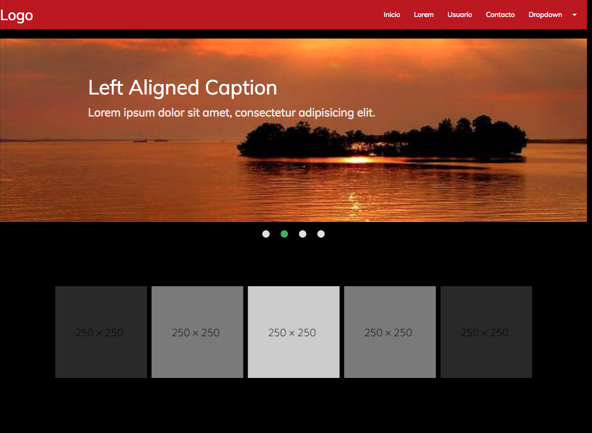
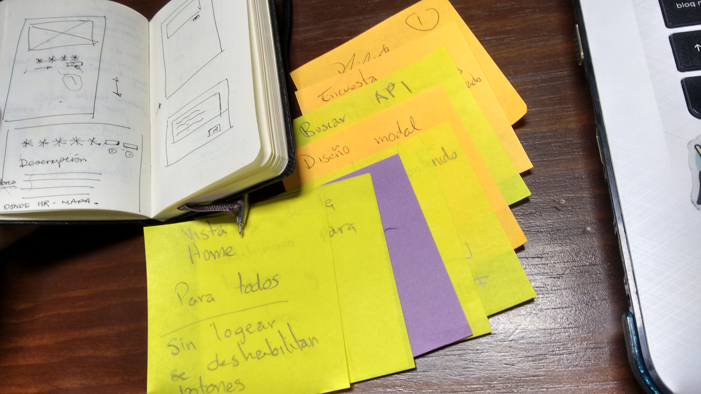

# **Te AtrappO**
by  ** *Equipo Cinco* **

Sitio Mobile friendly para que las personas tengan toda la información teatral al alcance de su mano en un sólo sitio.

### Problema (*Validando idea*)

En base a investigación e información pudimos percatarnos que hay poca afluencia en la escena teatral, desde las obras en teatro hasta las puestas en plazas públicas o parques. Poniendo en peligro éste medio de entretenimiento.

### Nuestros avances

* Idea clara y bien planteada.
* Planeación mediante alcance de tareas pequeñas e investigación.
* Creación de maquetado.
* Creación de pequeñas funciones.

### Nuestra organización

* *Lluvia de ideas* sobre qué podíamos hacer.  

* *Complementación de ideas* viendo lo que era viable y lo que no.

* Comenzamos a investigar y a maquetar, esto se repartió en *pequeñas tareas* conforme a skills, fortalezas y debilidades.

### Expectativas para el viernes.

* Implementación de APIs .
* Que todo sea funcional.
* Que sea visualmente agradable.

[Repositorio en Github - TeatrappO](https://github.com/RosyG/teatrappO "Repositorio en Github - TeatrappO").

